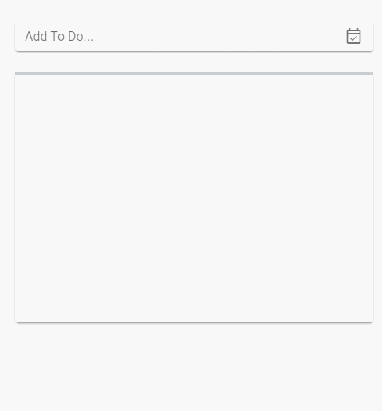
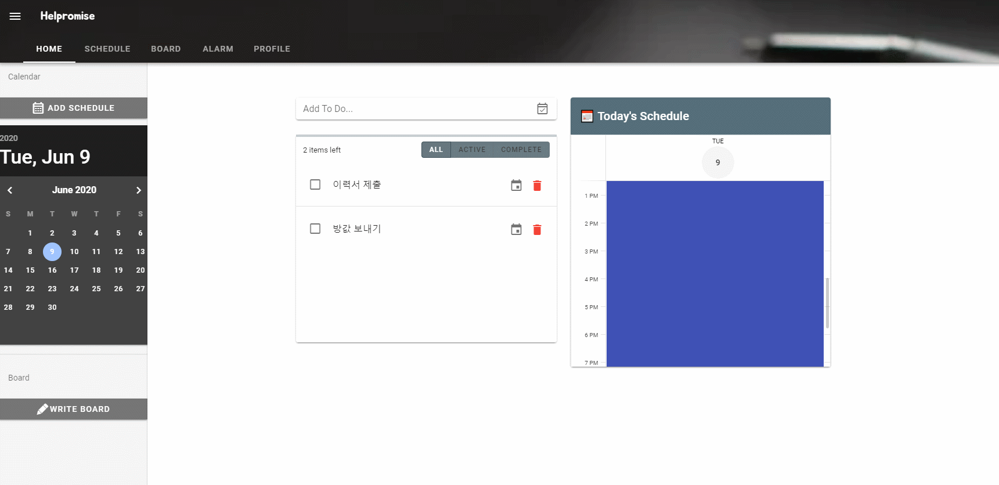
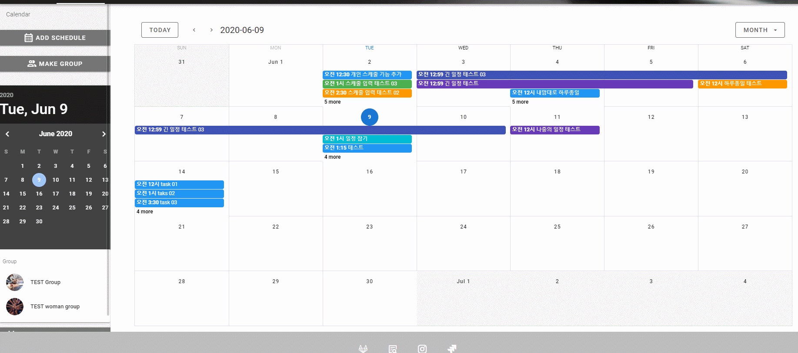
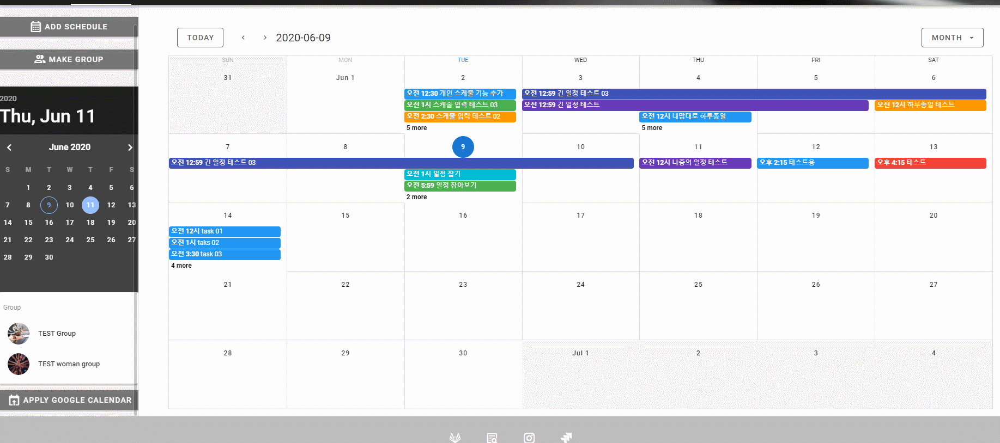
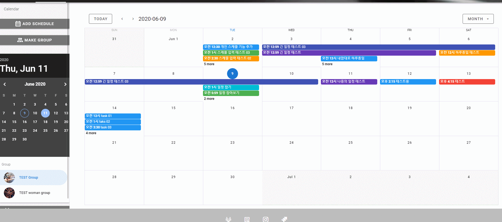
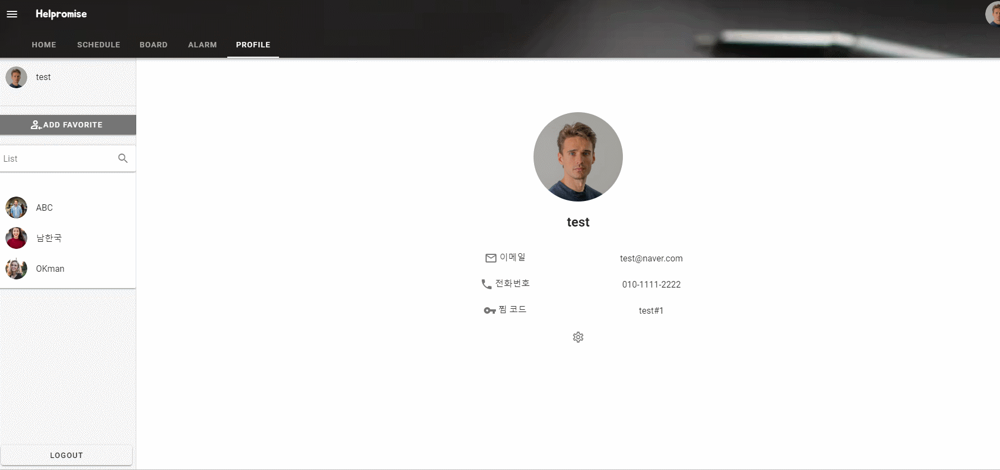

# 일정 공유 서비스 - Helpromise

> 2020.05.11 ~ 2020.06.05 | Full Stack

<br>

## 개요

개인의 일정을 관리하는 캘린더 플랫폼입니다.

다른 사용자와의 일정을 공유하고 새로운 일정을 잡는 과정을 보다 빠르고 편리하게 제공하는 서비스입니다.

### Server

-   `docker`를 이용하여 FE와 BE 환경에 맞는 이미지를 관리
-   Master와 Develop 브랜치를 나눠 배포단계에서도 배포환경 테스트 환경을 구분.
-   Jenkins를 이용한 빌드 자동화 시스템을 구축.
-   **FE의 경우 Nginx**를 이용, **BE의 경우 내장 톰캣** 사용.
-   aws에 docker hub를 설치하여 pull받고 컨테이너 올림.

### BE

-   Java의 `Spring boot`를 이용.
-   `REST API`를 이용하여 요청에대한 데이터 전송.
-   DB Layer의 경우 `MaBatis`를 이용하여 Query를 문서화하여 관리.
-   JWT 방식을 이용하여 세션 상태를 체크
-   웹 소켓 통신을 이용하여 그룹 일정에서 채팅을 통해 소통할 수 있게만듬.
-   `Google iCal url 을 이용해 iCal 파일을 받아와 데이터를 파싱`하여 구글 캘린더의 데이터를 회원 ID에 key로 매핑하여 Redis에 저장하여 구글 캘린더 정보를 불러오는 모듈을 만듬. 회원이 일정을 불러올때 구글 캘린더의 iCal값이 있는지 여부를 확인 후 일정을 가져옴.

### FE

-   Javascript의 `Vue.js`를 사용
-   `vuetify` 라이브러리를 이용하여 전체적인 디자인 설계 및 구현을 함.
-   `SPA방식`을 이용하여 렌더링 속도 상승
-   Vuex를 이용하여 JWT 토큰과 사용자 정보를 관리
-   일부 디자인 컴포넌트화하여 재사용성 올림.

### Dev

-   `Git flow`를 이용하여 각 기능마다 브랜치를 관리하고 MR을 통해 코드리뷰 후 develop에 머지 하도록 운영
-   PM은 `지라`를 통해 스프린트 기간과 목표 기능을 정하고 팀원들에게 이슈를 전달하고 보고받는 형식으로 프로젝트 일정 및 이슈를 관리함.
-   데일리 미팅을 통해 각 팀원들은 현재 이슈에 상태를 얘기하면서 프로젝트 진행도를 체크

<br>

## 기능 리스트

-   투두 리스트
    -   상세 페이지에서 시작시간과 끝시간을 설정하명 일정으로 관리 가능
-   일정 관리
-   팔로우
    -   내가 원하는 사용자의 코드번호를 알고있으면 팔로우 가능.
    -   팔로우한 사용자의 일정을 보는것도 가능.
-   구글 캘린더 가져오기
    -   구글 캘린더 iCal url 주소를 매핑하면 캘린더에 매핑됨.
-   그룹 매핑
    -   원하는 그룹을 만들어서 사용자 및 팔로우를 초대가능.
-   그룹 채팅

<br>

## ▶️ Run


### ~~docker 설치되어 있을경우~~ RDB를 삭제하여 불가능 ㅠ

```
    cd ./s02p31d104
    docker-compose up
```

### docker 없을 경우

-   java 1.8 version
-   node.js
-   RDB (helpromise schema)
    -   user : dev
    -   pwd : q1w2e3r4

```
    java -jar ./back-end/build/libs/back-end-1.0-SNAPSHOT.jar springboot.jar

    cd front-end
    npm run serve
```

<br>

## 디자인







